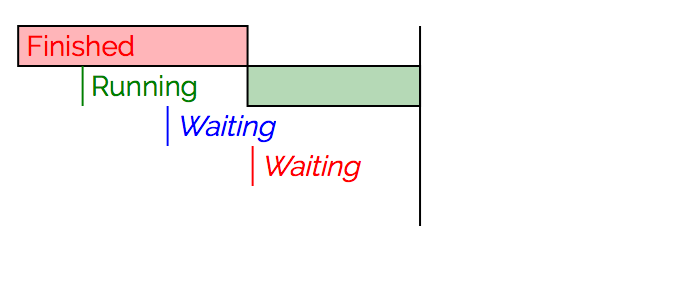

footer: Reginald @raganwald Braithwaite, PagerDuty Inc.

# `ember-concurrency`
### "an experience report"

---

## `ember-concurrency`

> ember-concurrency is an Ember Addon that makes it easy to write concise, robust, and beautiful asynchronous code.

--http://ember-concurrency.com/

---

# tasks and instances

```javascript
aTask = task(function * () {
  const { geolocation, store } = this.get(...);

  const coords = yield geolocation.getCoords();
  const result = yield store.getNearbyStores(coords);
  this.set('result', result);
});

anInstance = someTask.perform();
```

^ example from the docs
^ looks a lot like async/await!

---

# problems
# ember-concurrency
# solves easily

---

## Mashing the "submit" button on an update


^ sends multiple overlapping requests

---

# 💣


^ This is not what we want.

---

# concurrency protocols

```javascript
task(function * () {
  // ...
}).drop()
```

#### (ember-concurrency calls these "modifiers")

---

# 🎉


---

## displaying a loading spinner


---

# 🐛

```javascript
this.set('isLoading', true);
this.xhr = fetch(id).then(
  success => {
    this.set('isLoading', false);
    // ...
  },
  failure => {
    this.set('isLoading', false);
    // ...
  });
```

^ What if the component is destroyed?

---

# 🎈

```javascript
isLoading: reads('fetchTask.isRunning')
```

^ tasks can be inspected

---

# using
# ember-concurrency
# to solve other problems

---

## chunking updates to our api


---

# progress

```javascript
const chunks = _.chunk(incidents, CHUNK_SIZE);
let done = 0;

this.set('done', done);
for (const theseIncidents of chunks) {
  yield this.resolve(theseIncidents);
  done = done + theseIncidents.length);
  this.set('done', done);
}
```

---


---

# cancellation

```javascript
aTask.cancelAll();

anInstance.cancel();
```

---

# a bigger challenge

---

> In JavaScript, asynchronous tasks happen concurrently and unreliably.

---

^ Job Switching Video


---

# ⛈

```
websocket ping: [-----------------]
submit update:     [-----------]
```

^ We are notified that an update is available for our model and execute a fetch. While this is happening in one component,
our user submits an update in the foreground.

---

# ☀️



---

# sharing one task

```javascript
task(function * (promissoryThunk) {
  let result;

  yield promissoryThunk().then(value => {
    result = value;
  });

  return result;
}).enqueue()
```

---

# serialized results

```
websocket ping: [--------]
submit update:            [-------]
```

---

# ⁉️

^ what happens to our `isLoading` indicator?
^ sharing queues amongst multiple component instances

---

# task groups

```javascript
tasks: taskGroup().enqueue(),

handlePing: task(function * () {
              // ...
            }).group('tasks'),

submitUpdate: task(function * () {
                // ...
              }).group('tasks')
```

^ sharing task groups amongst multiple component instances

---

## ember-concurrency
# conclusion

---

## Simple things are easy,  complex things are *possible*.


